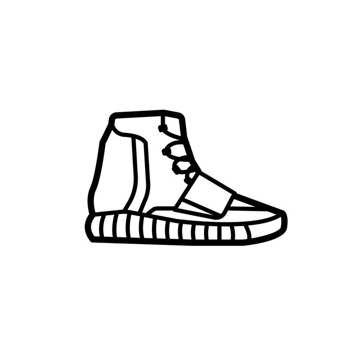

<a href="https://www.buymeacoffee.com/yasserqureshi" target="_blank"></a>
<br />
<p align="center">
  <a href="https://github.com/yasserqureshi1/Sneaker-Monitors/">
    
  </a>
  
  <h3 align="center">Sneaker Monitors</h3>

  <p align="center">
    A collection of web monitors that notify of restocks or updates on sneaker related sites through Discord Webhook
    <br />
    <a href="https://github.com/yasserqureshi1/Sneaker-Monitors/">Report Bug</a>
    ·
    <a href="https://github.com/yasserqureshi1/Sneaker-Monitors/">Request Feature</a>
  </p>
</p>
<br />

To be notified of changes, please **star** or **watch** this repository.
This will also increase the awareness of the project for others to use or add to. 


## About the Project
This project is aimed at providing web-monitors for various sites to the sneaker community for free. 
The monitors currently notify if a restock or release occurs via Discord Webhook.
Today, competition to purchase sneakers is getting increasingly difficult with resellers using paid automated tools to give them a massive advantage over everyone else.
As such, I have and will continue to develop monitors that will help those members that struggle to finally get the sneakers they want.

This project is continually expanding, and I would greatly appreciate any contributions. 
When contributing please fork the project and open a Pull Request.

*Below is a screenshot of the SNKRS monitor in action...*

<p align="center">
  
</p>

## Contents
* [About the Project](#about-the-project)
* [Monitors](#monitors)
* [Installation](#installation)
* [Set Up](#set-up)
* [Issues](#issues)
* [To Do](#to-do)
* [License](#license)
* [Contact](#contact)

## Monitors 

Currently the sites that have monitors are:
- All Shopify sites (e.g. Palace Skateboards, Hanon Shop, OVO, shopnicekicks.com, BDGA Store, Noir Fonce, Travis Scott, etc.)
- Supreme
- Nike SNKRS (Supports 42 countries - see the associated README file)
- Footsites (Footlocker UK, US, CA and AU)
- Ssense
- Zalando (UK)
- Off-Spring (UK)
- Solebox
- Snipes


## Installation
To install the modules, use the command in terminal (Mac or Linux) or command prompt (Windows):
```
pip install -r requirements.txt
```

This will install the following dependencies that are needed for the monitors:
```
requests
urllib3
logging
python-dotenv
bs4
free-proxy
```

## Set Up


Click on the image below to watch a YouTube tutorial on setting the monitor up locally...
[](https://youtu.be/mUTGCzWIDQk)

Click on the image below to watch a YouTube tutorial on setting the monitor up on a server...
[](https://youtu.be/nmUSSlt4JKk)

You will only need to interact with the ```.env``` file.
In the ```.env``` file, set the  ```WEBHOOK``` variable to your Discord webhook URL.
Below is an example of what the webhook URL should look like:
```
WEBHOOK = "https://discord.com/api/webhooks/..."
```


There is an optional ```PROXY``` variable for your own proxies.
There is a free proxy service already implemented if you do not have your own proxy. 
Please set the ```LOCATION_CODE``` variable to your location (or closest location) according to the list found [here](Location-Code-List.md) for the proxy. 
These proxies are scraped from [SSL Proxies](https://www.sslproxies.org/).
Below are two different structures if you are using your own proxy:
1. ```PROXY = "<proxy>:<port>"```
2. ```PROXY = "<proxy_username>:<proxy_password>@<proxy_domain>:<port>"```

Other details can also be edited such as the bot username, avatar and colour.
Other monitors may have other details in their ```.env``` files.
Please refer to that specific README.md file for details on setting up.

I will shortly be releasing a paid (but competitively priced) set of hosted monitors.
This would require only you sending me your webhook url and I will ensure that the monitoring service runs smoothly.
If you are interested in this scheme, let me know [here](#contact) and I can contact you once it is ready.

## Issues

If you find an issue, please open an issue [here](https://github.com/yasserqureshi1/Sneaker-Monitors/issues/new). 
I will respond fairly quickly and try to come up with solution.
I may ask you to provide the log file that is produced by the monitor.
It contains no personal data but may help me diagnose where the issue arises.

## To Do
 - [ ] Create price reduction monitors
 - [ ] Add other requested site (Off-White, Footpatrol, JD, BSTN, Size?, SNS, Naked, Net-a-porter, Footdistrict, oneblockdown, noirfonce and Sivasdescalzo)
 - [ ] Increase number of countries catered for

## License

Distributed under the MIT License. See ```LICENSE``` for more information.

## Contact

For help join my Discord server [here](https://discord.gg/jjbtWcBczb) and post a question in the #questions channel

